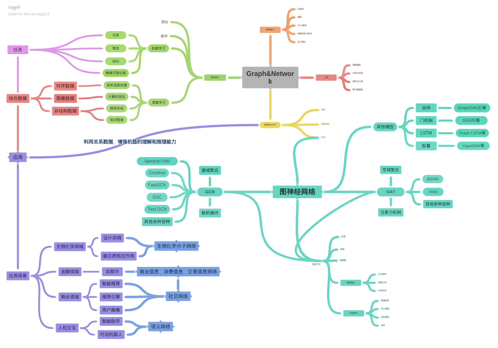

# notes

Personal study notes.

**目前更新的笔记内容有：**

## Part graph&network

### 1. 资源汇总

- [相关学习资源汇总推荐](./graph&network/README.md)
- [图嵌入和图神经网络综述类论文汇总](./graph&network/1.图嵌入和图神经网络综述类论文汇总.md)
- [网络表示学习模型汇总介绍](./graph&network/2.网络表示学习模型汇总介绍.md)
- [图开源深度学习库汇总介绍](./graph&network/3.图开源深度学习库汇总介绍.md)

### 2. 图神经网络

- [图神经网络介绍前言](./graph&network/GNN/图神经网络介绍前言.md)

#### 2.1 框架

- [PyTorch Geometric基本介绍](./graph&network/GNN/2.PyTorch_Geometric基本介绍.md)
  - 基本数据结构
  - 消息传递网络
  - 常用基准数据集 → [PyTorch Geometric自带数据集](./graph&network/3.PyTorch_Geometric自带数据集.md)
  - 小批量数据训练
  - 数据转换

#### 2.2 数据集

- [PyTorch Geometric自带数据集](./graph&network/3.PyTorch_Geometric自带数据集.md)
- [Planetoid数据集解析]()

#### 2.3 模型

- GAT
- GCN
- 

### 3. Q&A

- [从图嵌入到图神经网络的Q&A](./graph&network/从图嵌入到图神经网络的Q&A.md)（未完。。。）

---

  

主要介绍图神经网络，模型详细笔记有点难产，希望自己可以写的清楚明白。

---

最近在找工作，更笔记的时间少。┐(ﾟ～ﾟ)┌ 

如果有内推，欢迎联系我！

水平有限，笔记中有错误，欢迎issues指正！

欢迎沟通交流，欢迎star！

